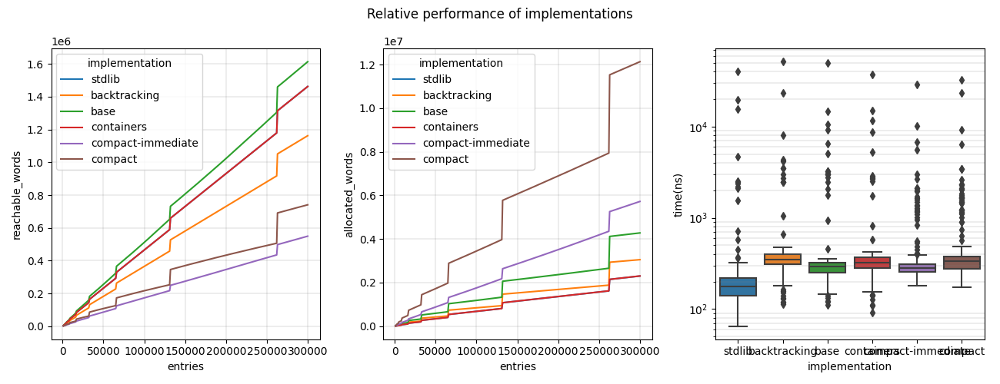
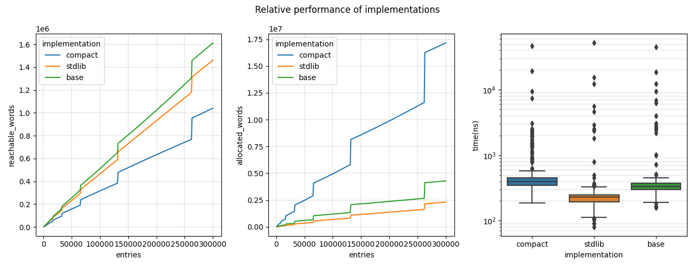

# Benchmark results

`Compact` datastructures are optimised for low static memory usage, at the cost
of generally higher transient allocations and slower runtime performance.

- [`Hashset`](#hashset)
- [`Hashtbl`](#hashtbl)

## Hashset

Memory and runtime performance of `int Hashset.t` for various implementations:

Implementations are configured as follows:

| Implementation      | Type                           | Description                                                                                                                                                                                                                       |
| ------------------- | ------------------------------ | ----------------------------------------------------------------------------------------------------------------------------                                                                                                      |
| `stdlib`            | `(int, unit) Stdlib.Hashtbl.t` | From the OCaml standard library (and the [`CCHashSet`][cchashset] module from [`containers-data`][c-cube/ocaml-containers]). Uses lists of `int * unit` pairs as buckets (as we're co-opting a hashtable implementation). |
| `backtracking`      | `int Hashset.t`                | From [`backtracking/hashset`][backtracking/hashset]. Uses `int` lists as buckets.                                                                                                                                                                              |
| `base`              | `int Base.Hash_set.t`          | From [`janestreet/base`][janestreet/base]. Uses AVL trees as buckets (with `unit` dummy values).                                                                                                                                                                                        |
| `compact`           | `int Compact.Hashset.t`        | From this library. Uses `int` arrays as buckets, resulting in more copying of buckets but smaller buckets overall than the above implementations.                                                                                       |
| `compact-immediate` | `int Compact.Hashset.Int.t`    | From this library. Uses `int` arrays as buckets with *inlined singleton buckets* (taking advantage of the fact that integers always have an immediate representation).                                                                    |

[cchashset]: https://c-cube.github.io/ocaml-containers/last/containers-data/CCHashSet/index.html
[c-cube/ocaml-containers]: https://github.com/c-cube/ocaml-containers
[backtracking/hashset]: https://github.com/backtracking/hashset
[janestreet/base]: https://github.com/janestreet/base

## Hashtbl

Memory and runtime performance of `(int, int) Hashtbl.t` for various implementations:

